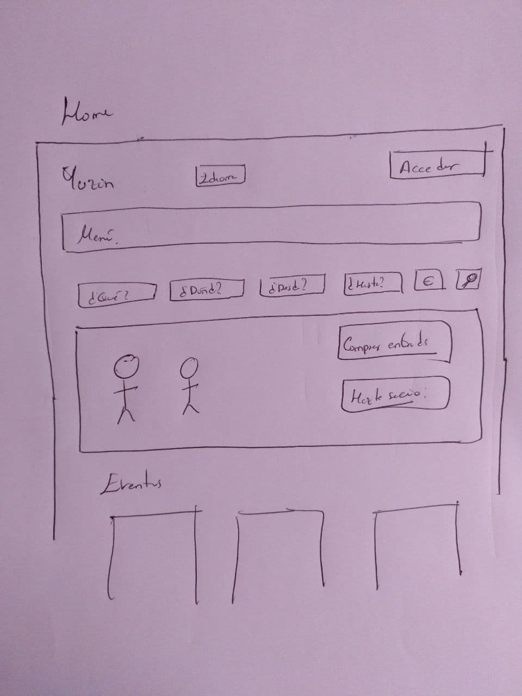
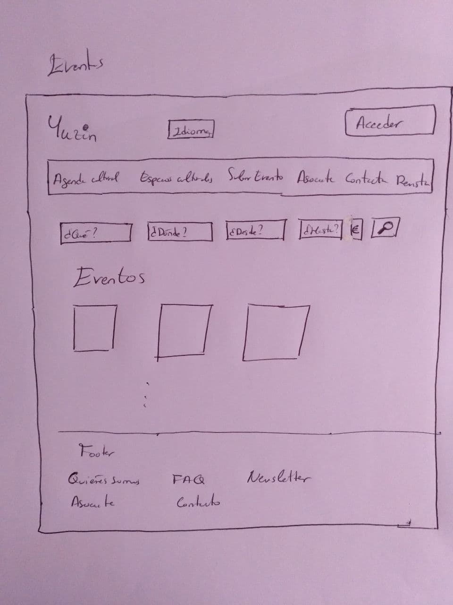
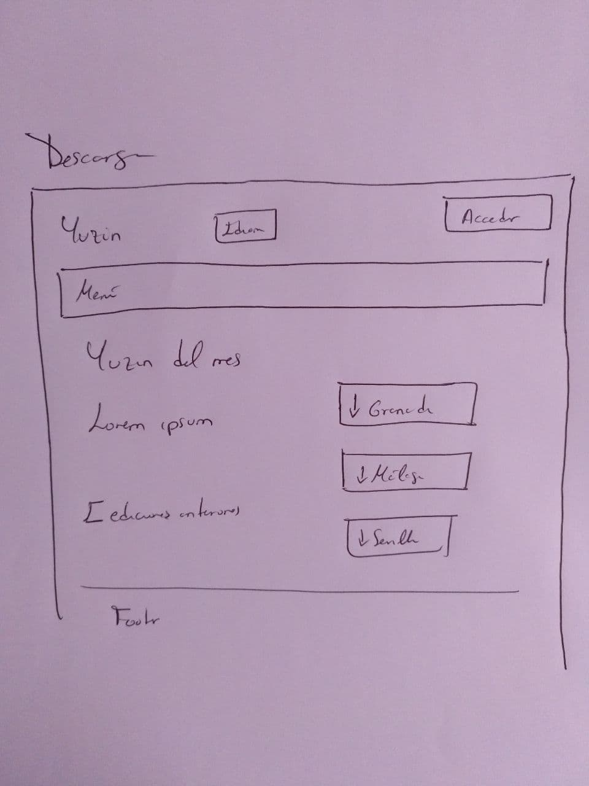
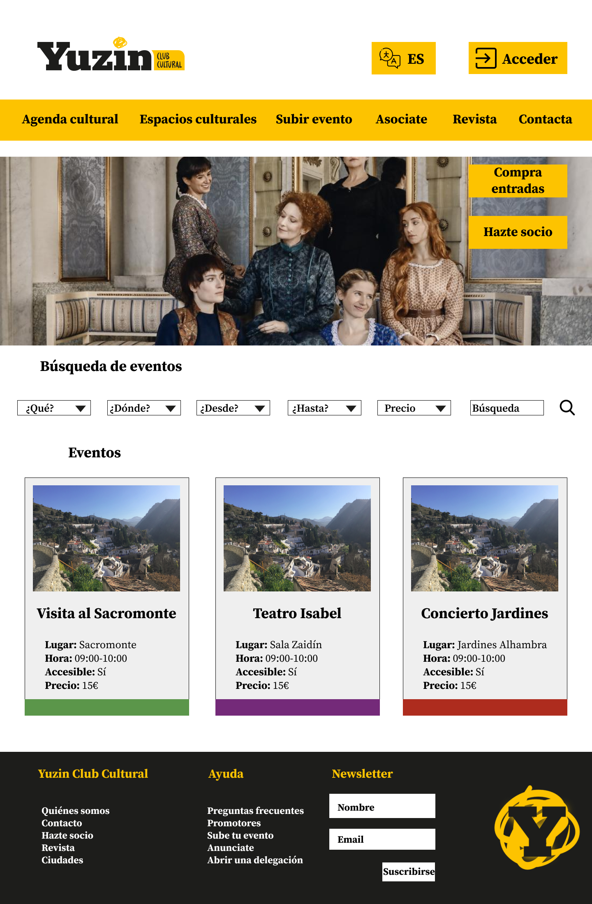
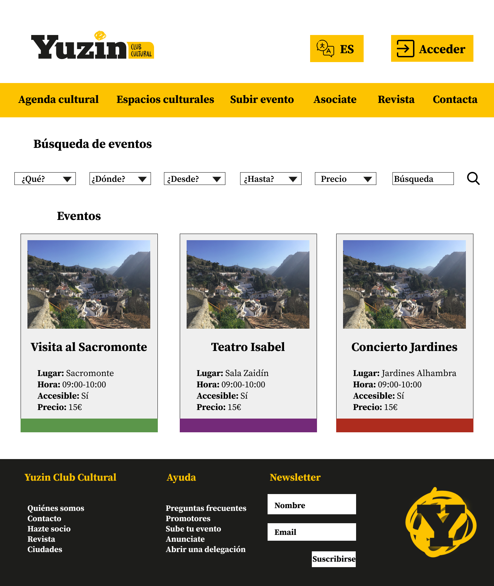
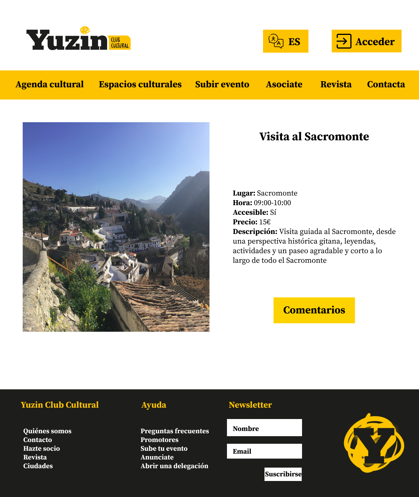
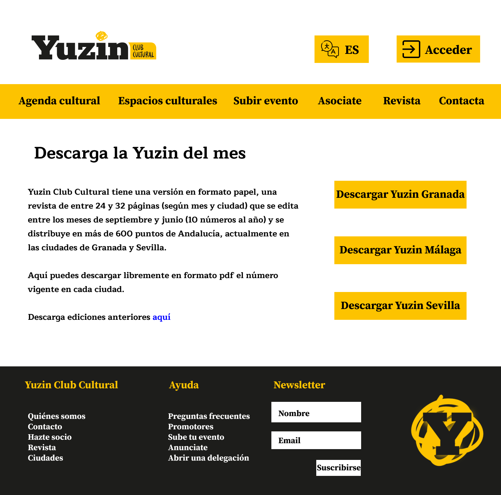
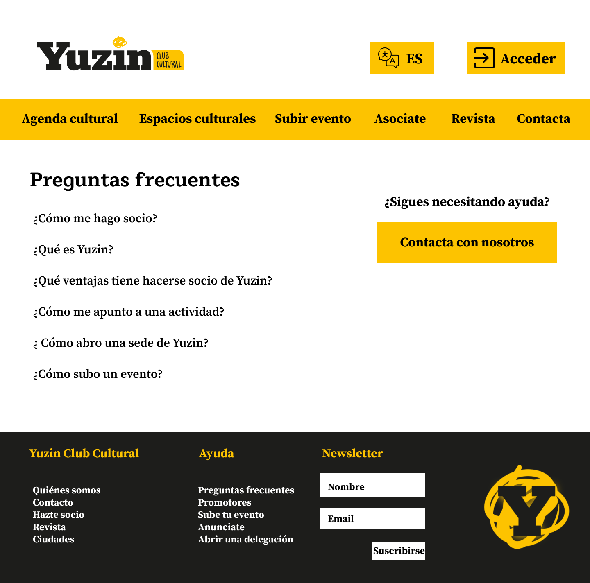

# Trabajo final DIU 2021

> Por Ana Buendía Ruiz-Azuaga

## Parte I: Mi experiencia UX

Al comienzo de la asignatura no tenía ninguna base sobre cómo deberían ser las interfaces, qué hacía bueno a un diseño o cómo se relacionaban los usuarios con las aplicaciones y páginas. 

A lo largo del curso, he aprendido gradualmente mediante diversas actividades y prácticas la metodología para realizar un buen diseño, cómo evaluar una interfaz existente y el uso de patrones.

Primero realizamos un ejercicio de etnografía, que consistía en observar una situación real en la que otra persona trata de realizar una actividad cotidiana y surge algún problema. Evaluamos por qué sucede este problema: un mal diseño, una falta de conocimientos previos o se ha visto influido por el contexto. De esta forma, empatizamos con el usuario mientras realiza una actividad, y vemos los fallos y dudas que le surgen en el proceso. Evaluamos si las dudas son por su estado y contexto, como ir con prisas, o son por un diseño poco intuitivo no accesible a cualquier usuario. Destacamos el caso de las personas mayores con la tecnología, que suelen necesitar ayuda. Este ejercicio consigue que empatices con los usuarios y evalúes qué aspectos y fallos tiene un diseño desde su punto de vista.

Después hice una comparativa entre las páginas web de tres universidades andaluzas (la UJA, la UGR y la UAL) aplicando diversas heurísticas y tests comparativos. Así, evaluamos cada página según los mismos criterios generales a toda página web (ayuda, contacto, información del sitio actual, etc) y tests adaptados al tipo de página, midiendo por ejemplo el número de clics necesarios para realizar una acción específica. Esto nos pone directamente en el lugar del usuario, valorando en cada caso la sencillez para hacer acciones usuales (y que, por tanto, deberían ser prioritarias y on un acceso rápido).

Finalmente estudiamos la accesibilidad de una página de un Ayuntamiento (aunque también se hizo un pequeño apartado sobre accesibilidad en la actividad anterior). Esta actividad me parece especialmente importante ya que, mediante extensiones, pudimos experimentar de primera mano las experiencias de usuarios con diversas dificultades en páginas reales y me hizo darme cuenta de la poca información y lo mal adaptadas que están las páginas en general a las personas con discapacidad. Siempre se destaca la importancia de hacer diseños accesibles e intuitivos a todo el mundo, pero en la mayoría de casos, incluso en páginas institucionales se descuida la información respecto a la adaptación a personas con necesidades especiales de la que se dispone y la proppia adaptación de las páginas en sí. En las prácticas de la asignatura mi compañero y yo le hemos dado bastante importancia a la información sobre accesibilidad de las actividades.

Las prácticas pueden consultarse aquí: [https://github.com/Mapachana/DIU21](https://github.com/Mapachana/DIU21).

En las prácticas hemos seguido una metodología real para crear paso a paso el diseño de una aplicación desde cero. Durante el desarrollo de las mismas he aprendido a realizar un análisis de competencia, una competencia muy útil en diversos campos de la informática, que ayuda a poner en contexto de qué quieres realizar y qué requisitos indispensables debe tener tu aplicación, así como qué funcionalidades gustan más a los usuarios.

Además, hemos creado personas ficticias y mediante ellas, nos hemos puesto en el lugar de los usuarios para analizar sus necesidades, tratando de cubrir las de todas las personas posibles. Por ejemplo, en nuestro caso usamos a Jorge, un chico con problemas de audición y Amparo, una mujer mayor sin conocimiento de las TIC.

Asimismo, para recopilar todas las necesidades de los usuarios aprendimos a realizar mallas receptoras de información y en teoría en las actividades de clase también mapas de empatía y diagramas POV. Esto ayuda en todos los ámbitos a organizar y descubrir las funcionalidades que nuestros usuarios esperan de una aplicación, no solo a nivel de interfaz y diseño.

Además, hemos aprendido a hacer prototipos de prueba (wireframe y mockup) en Figma, una herramienta muy útil, rápida y fácil de usar. Realizar prototipos me parece muy importante pues te hace plantearte qué busca el usuario, dónde, cómo quieres que interactúe con tu aplicación y qué quieres resaltar.

Junto a esto, el uso de patrones que se adaptan a las necesidades de tu aplicación para mostrar de forma correcta y clara al usuario la información necesaria, me parece muy útil.

También cabe destacar que he aprendido el concepto de branding y su importancia. Mediante las actividades de teoría en clase y las prácticas he comprendido el concepto de moodboard, lo que se quiere transmitir, la relevancia de los colores y tipografías empleadas y como elegirlas según el concepto de la aplicación y página. Por ejemplo en teoría hicimos el moodboard de insectos comestibles, para el que elegimos imágenes, tipografías y logos muy distintos a los que hemos usado en las prácticas para una aplicación de viajes a Granada. Los colores y estilos de letras transmiten ideas distintas y están basados en la aplicación. Igualmente, se aplica a la landing page, cuyo estilo debe ser más gráfico para captar la atención del usuario y hacer atractiva la aplicación. Todo siguiendo el mismo estilo que el mockup para crear tu propia marca y que tu aplicación sea reconocible.

Además, hemos aprendido a hacer reportes y cuestionarios SUS para evaluar las aplicaciones, de forma que podamos comparar nuestro diseño con otro, detectar los fallos del mismo y corregirlos.

En conclusión, he aprendido cómo desarrollar una aplicación atendiendo a las necesidades de todos los usuarios  cómo extraer dichas necesidades, clasificando las funcionalidades según prioridad. Realizar tests y evaluaciones de páginas y cómo elegir y definir el concepto de una aplicación, para luego aplicarlo al prototipo (mockup) y landingpage, creando así tu imagen de marca de forma correcta según el propósito de tu aplicación.

Todo esto son conceptos muy importantes que sirven tanto en el ámbito de esta asignatura como otras, por ejemplo el análisis de las funcionalidades necesarias de una aplicación es complejo y aquí hemos aprendido herramientas para descubrir las necesidades de los usuarios. Además el branding es muy importante para hacer tu idea atractiva y reconocible a los usuarios, ya que aunque tu producto sea bueno, si los usuarios no están cómodos o no consideran la interfaz agradable no recomendarán tu producto a otras personas.

## Parte II: Caso de estudio. Web YUZIN
 
 ### El rediseño y cambio de orientación de la web

 La página web de Yuzin sufrió un rediseño hace unos años. En este cambio, Yuzin pasó de ser una página para descargar su revista de forma digital a un club de cultura.

 Al realizar este cambio, el objetivo de la página cambió, así como el público objetivo de la misma, por lo que tiene sentido que se llevara a cabo un rediseño completo de la página.

Ahora el objetivo de la página es ofrecerte información sobre las actividades culturales que se están llevando a cabo en Granada y Sevilla y ofertas en muchas de estas actividades a los miembros suscritos. Es decir, su producto ya no es solo la revista, también es intentanr que te suscribas para obtener las ventajas que ofrecen.

El rediseño está más orientado a que el usuario vea las ofertas y descuentos que se obtienen al suscribirse y las actividades del mes. También se puede descargar la revista, de la que se recibe una copia física una vez eres miembro del club.

En conclusión, me parece que el rediseño de la página era necesario al cambiar el objetivo y público al que va dirigido de la misma.

A continuación, vamos a analizar algo más en profundidad el diseño de la página.

### Usabilidad

Comenzamos notando que tiene un diseño responsivo, aunque algunas cosas se ven movidas. Si bien, su diseño en móviles tiene un problema, y es lo poco intuitivo que resulta desplegar el menú con las opciones. Al entrar en la página vemos

Para desplegar el menú debemos pulsar en el rectángulo amarillo, entonces podremos acceder a él.

Esta forma de acceder al menú no es nada clara para ningún usuario, lo que dificulta el uso de la web en dispositivos móviles.

También observamos que en la página no se muestra ninguna información de en qué sección del menú estamos actualmente.

Respecto a las opciones del menú principal, a primera vista no se sabe muy bien la diferencia entre "agenda cultural" y "espacios culturales", pudiendo confundir a los usuarios sobre qué opción deben escoger para buscar algo en concreto.

El submenú consta de las opciones "Descargar revista", un número de teléfono para contactar por whatsapp y el enlace para acceder a la plataforma. Para empezar, el número de teléfono no es un enlace ni una subcategoría, por lo que está fuera de lugar en el menú.

La sección de ayuda se encuentra en el footer, donde tenemos un apartado de preguntas frecuentes y un apartado de contacto en el que podemos rellenar un formulario o llamar por teléfono.

Respecto al buscador, tenemos que está visible siempre en todas las secciones, lo cuál puede inducir a confusión. El buscador consta de dos partes, la parte por criterios de búsqueda y otra por términos que introduce el usuario:

Al intentar usar el buscador por términos del usuario, no ha funcionado, se han aplicado solamente los criterios de búsqueda del buscador por criterio, incluso cuando no se ha especificado ningún criterio en el mismo.

El buscador por criterio me parece bastante incompleto, ya que podría añadirse criterios por precio, y en el buscador por lugar solo aparecen Granada y Sevilla, cuando Málaga también tiene revista de Yuzin. Además, el buscador por tiempo sería mejorable pudiendo elegir desde qué día hasta qué día quieres que muestre los eventos desplegando un calendario para marcarlos. Haciéndolo así más intuitivo.

También cabe destacar que hay enlaces que no funcionan, por ejemplo cuando intentas suscribirte y pulsas en suscripción, te lleva a la misma página. Y al pulsar en acceder, te lleva a una página donde iniciar sesión, pero no explica que para registrarte debes estar suscrito ni hay ningún enlace a suscribirse desde la parte de acceder, lo que hace difícil percatarse de que para tener una cuenta necesitas suscribirte a Yuzin.

### Branding y estética

Para empezar, cuando entramos en la página, la landing page no deja claro sobre qué va la página. Lo primero que vemos es 

No tenemos ninguna imagen que llame demasiado la atención e indique la temática de la web.

Respecto al logo, tenemos la versión completa y algo más pequeño que usar cuando haya poco espacio:

Respecto a los colores, parece que su color principal es el amarillo y un gris oscuro/negro.

Para identificar su tipografía, he usado la página [https://www.myfonts.com/WhatTheFont](https://www.myfonts.com/WhatTheFont), de donde he obtenido que para editar la revista usan Serif Pro y en la página algo similar a una Boxkey Regular.

Creo que ambas fuentes deberían ser la misma para dar una misma imagen de marca.

También cabe destacar que su paleta de colores usa muchos colores distintos:

Lo que dificulta dar una imagen de marca y cohesión al estilo de Yuzin.

También me parece que el submenú podría eliminarse, eliminando la información de contacto, añadiendo el enlace a descargar la revista al menú principal y colocando el botón de acceder arriba a la derecha, de forma que quede más limpio.

### Accesibilidad

La página solo está disponible en español, por lo que personas que no hablen el idioma no podrían recurrir a ella para buscar información de diversas actividades.

Además, usando la extensión usada en clase para simular distintas discapacidades he podido comprobar que las personas con discapacidad visual (como daltonismo o ceguera al color completa) pueden entender correctamente la página. La web soporta bien el zoom (hasta más de un 300%) para personas con problemas de vista.

Los botones de los eventos son relativamente grandes, de forma que no resulta demasiado difícil a las personas con parkinson seleccionarlos, si bien las opciones de los criterios de búsqueda pueden resultar algo más complicadas.

Finalmente la página se ve correctamente al desactivar el javascript y es apta para lectores auxiliares.

### Rediseño

Para el rediseño voy a intentar mantener los elementos principales del original, esto es, mantener el logo y sus colores base. Para obtenerlos he usado una captura de pantalla y conseguido sus valores hexadecimales accediendo a [https://imagecolorpicker.com/](https://imagecolorpicker.com/).

Para crear la paleta he usado [https://coolors.co/](https://coolors.co).

Mi propuesta de paleta es la siguiente:

donde he intentado reducir el número de colores empleados manteniendo el amarillo y negro del logo, que se asocian a Yuzin.

Para la tipografía, voy a usaré "Source Serif Pro" para la web por su legibilidad y simpleza, y para los títulos usaré "Maitree" ya que es una fuente similar a la empleada en el logo.

Primero he realizado el wireframe de las páginas ,más relevantes de la web: home, la página de eventos y la página para descargar la revista.

Para el diseño de la página, voy a usar diversos patrones:

* [**Calendar picker**](http://ui-patterns.com/patterns/CalendarPicker): Necesario a la hora de filtrar búsquedas según fechas, para poder elegir intervalos de tiempo o días consultando directamente un calendario. Este patrón nos resultará especialmente útil en el buscador de la web.

* [**Input Feedbak**](http://ui-patterns.com/patterns/InputFeedback): Útil cuando un usuario introduce ciertos datos, permitiendo que compruebe por sí mismo y símbolos visuales que los datos introducidos son válidos. Lo usaremos tanto al registrarse como en el apartado de ayuda, que los usuarios pueden usar para contactar y al suscribirse a la newsletter.

* [**Input Prompt**](http://ui-patterns.com/patterns/InputPrompt): Utilizado en el buscador para expresar claramente su funcionalidad. De nuevo, será necesario en el buscador y apartado de contacto para esclarecer la infomación que se requiere en cada apartado.

* [**Home Link**](http://ui-patterns.com/patterns/HomeLink): Utilizamos el logo de la aplicación como enlace directo y desde cualquier página a la página principal (Home). Este patrón afecta a toda la aplicación, haciendo siempre accesible el home de la aplicación en cualquier momento.

* [**Continuous Scrolling**](http://ui-patterns.com/patterns/ContinuousScrolling): Las listas de actividades, establecimientos o las preguntas frecuentes (faq) se encuentran en una misma página que las lista, pudiendo acceder a todas ellas haciendo scroll en la página adecuada.

* [**Tagging**](http://ui-patterns.com/patterns/Tag): Las diversas actividades y establecimientos ofertados admiten etiquetas para simplificar las búsquedas según temas. Además, al buscar eventos estos aparecen con una franja de color (rojo, morado, azul o verde) que indica qué temática tiene cada uno. Por ejemplo, las visitas guiadas llevan una franja verde y las representaciones de teatro una morada, facilitando así al usuario reconocer la temática de cada evento ofertado sin necesidad de leer la descripción.

* [**Frequently Asked Questions (FAQ)**](http://ui-patterns.com/patterns/frequently-asked-questions-faq): Dedicamos una sección de la app a preguntas que suelen repetir los usuarios, de manera que los mismos tengan acceso rápido y sencillo a soluciones frecuentes, facilitando el uso de la aplicación a nuevos usuarios o personas con poco conocimiento en el campo de tecnologías, así como evitamos una saturación del contacto.

* [**Gallery**](http://ui-patterns.com/patterns/Gallery): Utilizamos amplias galerías de imágenes en cada actividad.

* [**Live Filter**](http://ui-patterns.com/patterns/LiveFilter): En el buscador utilizamos varios filtros de distintos tipo para que el usuario haga la búsqueda que más se ajuste a sus necesidades.

* [**Lazy Registration**](http://ui-patterns.com/patterns/LazyRegistration): Permitimos que cualquier usuario que acceda a la app pueda navegar sin ningún problema sin necesidad de registrarse.

Finalmente, basándonos en el wireframe hecho anteriormente y usando la paleta de colores y tipografías especificadas antes, diseñamos el siguiente mockup usando Figma:

El mockup puede consultarse en formato pdf [aquí](https://github.com/Mapachana/DIU21-TrabajoFinal/blob/master/mockup.pdf).

El rediseño ha sido leve, manteniendo el logo y colores principales, con el fin de que la marca no pierda su identidad y siga siendo reconocible por todos sus usuarios previos. Es decir, cualquier persona que conociera Yuzin de antes, sigue reconociendo su logo y colores, de forma que no se ha perdido continuidad ni se ha realizado un branding desde cero, de esta forma no confundimos a los usuarios. He querido hacerlo así ya que es algo bastante común en marcas grandes, por ejemplo discord realizó un rebranding hace poco cambiando el logo, tipografía y paleta de colores ligeramente, de manera que sigue siendo perfectamente reconocible por todos y no empieza desde cero. Otras compañías más grandes, como google, pueden permitirse hacer un rebranding desde cero debido a su alta popularidad. Como Yuzin es un club relativamente pequeño, he preferido mantener el núcleo de su identidad intacto.

Además, el rediseño de la página no ha sido notorio en cuanto a diseño en general, me he centrado en corregir pequeños errores como el buscador usando calendarios especificando fecha de comienzo y fecha de final, unificar los dos menús en uno solo, añadir una funcionalidad para cambiar idioma y recolocar el acceso a la plataforma a un sitio más usual (arriba a la derecha).

También he eliminado el buscador de eventos de las páginas donde no es necesario y dado más relevancia en la página home a la imagen inicial, así como añadido dos letreros: uno para comprar entradas del evento que esté al inicio y otro para hacerse socio de Yuzin, que es el objetivo de la web. Asimismo he unificado las fuentes usando las mencionadas al inicio y reducido considerablemente la paleta de colores de la web original.

